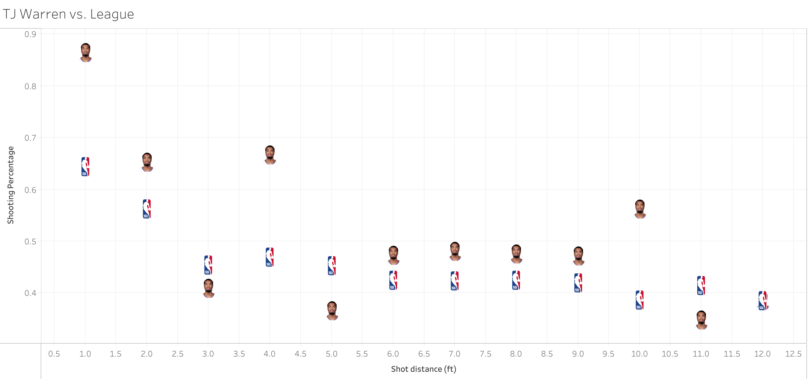
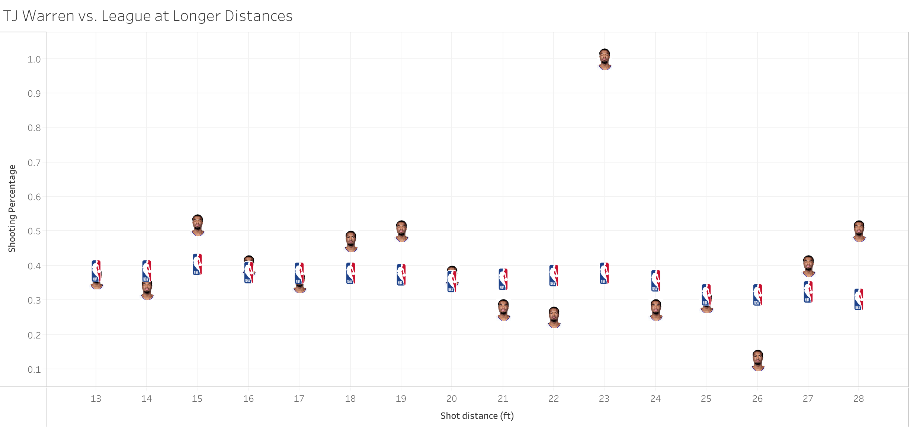

<!-- Image with distances from 0-15 ft -->
<h2> Highlight: TJ Warren, short distance master? </h2>

 
    Coming into this dataset, I expected the most efficient shooter at high volumes closest to the basket to be a center a la Shaq with the intuition to slam dunk everything or a point guard like Tony Parker able to slice defences on his way to the basket. The surprise winner of most efficient player with shots  &lt;1 ft away from the basket: TJ Warren. A small forward whose playstyle fits neither of those descriptions  <b> [1] </b>  . How is this possible? A review of the highlights reveals a bold driver whose layups and floaters have an unclear release point that may result in the tallies of shots next to the basket.

<figure>
    
</figure>

    This dominance at close range from 1-4 feet out from would backup the suggestion that this dominance stems from layups as opposed to dunks by adept centers whose shot distance profiles drop off more drastically from greater than 2 feet. 

<figure>
    
</figure>

<h3> So why isn't TJ Warren more playable? </h3>
<h4> Long distance shooting leaves a little to be desired </h4>

    Looking further at TJ Warren's shooting percentages at show an average / above-average mid-range shooter but a poor long-range shot-taker. Of course, he seems to be aware of his lower ability or the gameplan schemes away from TJ shooting anything beyond the 3 point line. The volume of shooting in the midrange (~3 shots in the midrange per game) would suggest something. 

<figure>
    
</figure>

    Don't be fooled by the 100% shooting from 23 feet out. TJ has taken and made just one shot from that distance. 

<h4> TJ is a bit of a black hole </h4>

    Among the top 12 players in total minutes for the Suns in the 2016-17 season, TJ Warren ranks 8th best with an assist rate of 1.3 assists per 36 minutes played. The players with worse rates? All 3 centers (Alex Len, Tyson Chandler, Alan Williams) and the rookie power forward, Marquese Chriss. Again, this could be a result of the gameplan  <b> [2] </b>   or TJ Warren's inclination to not pass once he had the ball. One strange wrinkle is that the player that TJ Warren assisted the most was Marquese Chriss. Conversely, the player that Marquese Chriss assisted the most was TJ Warren. The numbers would suggest that there was some sort of chemistry that the two developed but the only evidence I could find immediately is a nice pass from TJ to a dunking Marquese.

 
<figure>
    
</figure>

 Disclaimer: Gifs are via Dawkins and are not mine 

