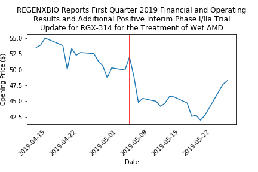
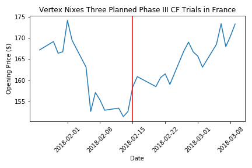
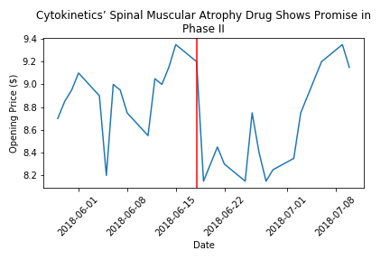

<h1> Predicting stock gains after clinical trial announcements </h1>

 Summary: I have created a machine learning model that predicts whether a biotech stock will have a large increase in price after a clinical trial announcement. I collected opening stock price and trading volume data for biotech companies on the NASDAQ centered around announcements of passing/failing clinical trials. The current form of the model is a binary SVM predicting whether prices surprass a growth target.  

<h2> Quick Takeaways </h2>
<ol>
    <li> The assumption that <i> good </i> news results in gains in stock price is not a valid assumption due to external factors that can override the positive news. </li>
    <li> However, <i> bad </i> news almost guarantees a drop in stock price </li>
    <li> As always, it is hard to predict an unpredictable stock market. </li>
</ol>

<h2> The resulting method </h2>

 The final method found in this current iteration was an SVM delineating between events that do or do not result in gains of 7.5% of opening price between the day of the clinical trial news and 14 days afterwards.
    

    
<h2> The process </h2>

<h3> Data Collected </h3>
<ul>
    <li> Headlines scraped from a biotech news website from the past 3 years </li>
    <li> Stock prices (opening, closing, day highest, day lowest) of companies categorized as biotech on the NASDAQ from the past 3 years </li>
</ul>
<h3> Features Used </h3>
<ul>
    <li> Stock price openings the day of, normalized to each other. </li>
    <li> Past stock prices in comparison to day of announcement </li>
    <li> Derivatives of movements of stock movements </li>
    <li> Same methods as above but for volumes of stocks moved instead of prices </li>
    <li> Headline sentiment analysis </li>
</ul>
<h3> Python Packages Used </h3>
<ul>
    <li> pandas: For holding the data in manipulatable dataframes </li>
    <li> numpy: For various math functions </li>
    <li> sklearn: For machine learning algorithms and data normalization </li>
    <li> Various self written functions to modify and clean the data </li>
</ul>

<h3> Model Selection </h3>

 <b> First attempt: </b> The first methods concentrated on building a regression that could predict the median future opening price. Using an elastic net regressor I was able to initially obtain an r-squared of ~26% . However, this process was scrapped for being unrealistic to the real world scenario. The reason being that the median can only be known in retrospect and cannot be known <i> at the time of selling. </i> 

 <b> Second attempt: </b> I simplifed the approach via changing the prediction to a simple binary of a gain of greater than 7.5% of the price and thus changing the learning algorithm from a regressor to a binary classifier. Testing of all the different kernels resulted in a linear kernel giving the most desired outcome. Results were obtained in a 5-fold CV against itself. 

<h3> Results </h3>

<ul>
    <li> Non-linear kernels erred on predicting everything as a negative (no success) outcome which resulted in '% correct' statsitics being similar to the linear kernel result. Looking at the resulting confusion matrices showed the clear differences between the different kernel methods in the end. </li>
    <li> The current precision achieved is 53% and the current sensitivity is 33% </li>
    <li> Phase of the trial (I, II, or III) was not a significant feature </li>
    <li> Sentiment of the headline was a significant feature </li>
    <li> As expected, standard mathematical features were significant though unexpectedly at multiple timescales (e.g. 3-day vs. 25-day windows before announcement). </li>
</ul>

<h3> Special cases for future consideration </h3>

 The following are special cases I noted while looking through the data. Each graph title is the published headline itself. The red line in each graph signifies the date that the headline was announced. Therefore, you can see stock performance before and after the announcement. 

<h4> Financial reports hidden with clinical trial news </h4>

<figure>
    
</figure>

 In this case, positive clinical trial news is met with a sliding stock price. What happened? Quarterly financial numbers were released at the same time and portrayed a company with less than desirable cash flows. So despite the good clinical news, the financial news was the overriding influence. 

<h4> Coinciding news dominates the change in price </h4>

<figure>
    
</figure>

 The headline announces nixed trials in France for Vertex yet the stock price soars? Normally the assumption is that bad news equals a tumbling price. Turns out that earlier that week, the FDA approved a treatment sold by Vertex for marketing in the US which most likely explains the soaring of the price. 

<h4> Underlying text of report is not optimal despite headline </h4> 

<figure>
    
</figure>

 Another case of 'positive' news met with a slide in price. Further investigation into the data presented by Cytokinetics in this scenario displayed no superior performance to the standard-of-care in many time frames except one. This brought up the question on whether the drug had a long-term, pernament benefit. On the other hand, the drop wasn't too precipitous and the price recovered soon after. 
    

<h2> Future work </h2>
<ol>
    <li> Include features for  financial reports </li>
    <li> Include features for portfolio and pipeline products (in progress) </li>
    <li> Include features for competitors (e.g. there are many biotech companies concurrently trying to treat duchenne's dystrophy and cystic fibrosis which are relatively rare diseases with an occurrence of ~1,000 new cases per year)</li>
    <li> Create a more refined model that differentiates between loss, no change, or gain in opening stock prices after clinical trial announcements </li>
    <li> Include confidence intervals (in progress) </li>
    <li> Create a Monte Carlo simulation version of the model with the data provided. </li>
</ol>