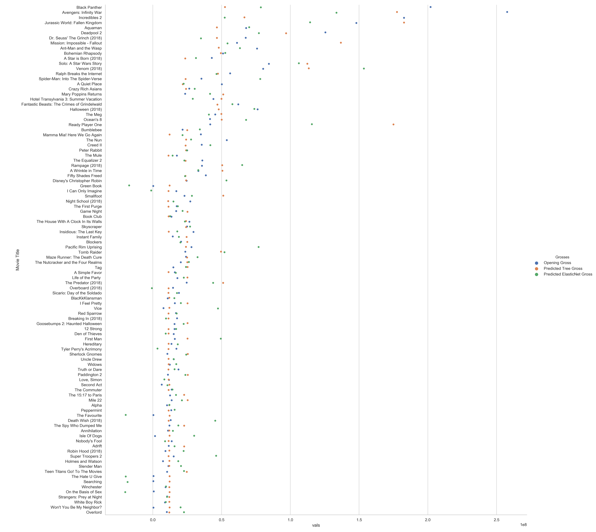

<h1> The Social Media Box Office Predictor V1.0 </h1>

 - Can I model opening box office gross based on social media reaction to a trailer?
    - I built a regression model based on comment reactions on Reddit to the first trailer released for the movie. Reddit is a social media forum that allows for the posting of trailers to the website and said posts attract comments Comments and relevant content information were extracted from Reddit using the 'praw' package. These comments were then analyzed using Facebook's fasttext python package trained on the ISEAR text sentiment dataset. I then used the sklearn package to train decision tree and Elastic Net models on the comment data. The resultant models tended to undepredict the highest-grossing movies and niche films but serve as a nice starting point for further improvements. 
 
 - What is the data used here 
 
    - The initial movies chosen for this question were the 100 top grossing movies in 2018 according to BoxOfficeMojo. I extracted the data from the BoxOfficeMojo website with the aforementioned qualifications. 
    - Reddit was chosen as source of social media for ease of data collection and use of API. The comment section for the first official trailer was chosen as the source of a 'social media reaction'. Exceptions were made when the "teaser" trailer was indistinguishable from a normal trailer (opposed to teasers that typically were <1 minute in length and showed very few to no scenes from the movie). I manually selected and gathered the IDs from the urls of the comment sections following the requirements. 
    - Of course, Reddit comes with the caveat that these reactions are skewed towards a audiance with a higher representation of upper-class, white, males. This results in muted comment sections for movies that favor different audiences such as Tyler Perry movies (African-American) and religious films. 
 
 - How did I acquire the data (packages, api)
    - I used the 'praw' package to access the reddit api and gather comments. I extracted comments from the trailer posts using the IDs collected beforehand using the info() batch method (as preferred by the Reddit API). For large posts with more than ~1000 comments, I used only the default number of comments collected which amounted to a few hundred on average.  
 - How did I analyze the data
     - I used the tweet sentiment dataset from ISEAR. The tweets were then cleaned and filtered using a custom filter borrowed and tweaked from Sanket Doshi at TowardsDataScience. 
     - Unsure with whether to analyze comment sections in full or line by line, I split the pipeline into two concurrent datasets to see if one would perform significantly better than the other. One method was to analyze the comments section as a whole and take the top 3 predicted sentiments with a ratio of likeliness for each sentiment. The other method was to predict the sentiments for each line and take the 3 most commonly predicted sentiments with the ratio of those comments out of the total. 
 - Train the model
     - The final training dataframe for training was built out of social media analysis, opening number of theaters, and reddit post information. Sentiment labels were transformed from categorical data into numerical data through a OneHot-like method. The opening number of theaters was gathered through the BoxOfficeMojo dataframe. I added other numerical features such as the number of comments in the comment section, score of the post, and the upvote ratio all from the 'praw' data gathering. The results array was the opening weekend domestic gross for the movie. 
    - I trained two regression remodels from sklearn: a decision tree and an Elastic Net. The decision tree was chosen for the belief that it would better make use of the categorical data (i.e. the sentiment labels) than the elastic net. The elastic net is my go-to model for regression for its best of both worlds use of l1 and l2 penalties. Both models were trained on a one-out cross validation regimen to maximise use of the small data set. 
 - Results
     - Neither the decision tree nor the Elastic Net significantly outperformed each other. Given the first method of analyzing the comment section as a whole, the RMS errors for the decision tree and Elastic Net models were 2.88 * 10^7 and 2.92 * 10^7 respectively. For the second method of analyzing the comment section line by line, the errors were 3.22 * 10^7 and 2.92 * 10 ^ 7. Visually plotting out the different predictions from the decision tree and Elastic Net models shows no discernible trends either. 
     

- Future looks
     - Add past year averages for that date
         - Adding past year averages may help solidify predictions with the expectation that movies that generate similar social media buzz would perform differently on a hot summer weekend as opposed to a cold, dreary winter weekend. However, there may be some redundancy as movies that generate larger social media buzz are already placed in higher performing weekends and the same goes for the contrary. 
     - Add studio averages
         - Adding studio averages may help reduce the size of the holes for niche movies coming from studios with proven track records. This feature howeve would not be able to catch surprise movies from new studios. In this data set, this would probably improve the prediction for a Tyler Perry movie but I am doubtful it would lead to a more accurate prediction for 
     - Add more social media to analyze 
         - As noted before, Reddit is not a fully accurate representation of the movie-going population. Other possible options would be scraping tweets or film festival reviews. 
     - Super stretch goal: Add actor / director averages
         - This would be another feature to try to account for actors and directors that would bring in tickets that may not captured in social media. Actors such as Dwayne Johnson have starred in movies that may not elicit strong emotions (Rampage, San Andreas, etc.) but enough emotion to bring in ticket sales. 